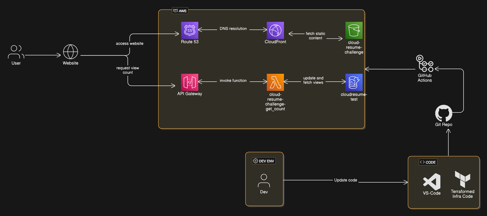

---

# 🌩️ Cloud Resume Challenge

## 📝 Description
This project is part of the **Cloud Resume Challenge**, where I built and deployed my resume as a static website using **AWS services**. The website includes a **visitor counter** powered by **AWS DynamoDB**, **Lambda**, and **API Gateway**, with **CI/CD pipelines** managed via **GitHub Actions**. The infrastructure is provisioned using **Terraform** for **Infrastructure as Code (IaC)**.

More detailed notes can be found in this repos (/project-resources/detailed-walkthrough-notes)

---

## 🛠️ Prerequisites
- **AWS Account** 🖥️
- **Visual Studio Code (VSCode)** ✍️
- **GitHub Account** 🐙
- **Terraform** 🏗️ (for Infrastructure as Code)
- **AWS CLI** 🔑 (for local configuration)

---

## 🚀 Project Breakdown

### 1. **📄 Resume/CV Creation**
   - Created a resume using **HTML** and **CSS**.
   - Customized a template to suit my preferences, removing unnecessary pages and modifying the design.

### 2. **🌐 Static Website Deployment on AWS S3**
   - Created an **S3 bucket** in the **Europe (London)** region for faster load times.
   - Enabled **static website hosting** and configured the bucket to serve the `index.html` file.
   - Set **default encryption** and added tags for project identification.

### 3. **🔒 HTTPS via AWS CloudFront**
   - Configured a **CloudFront distribution** to serve the website over **HTTPS**.
   - Set up **Origin Access Control (OAC)** to allow CloudFront to access the S3 bucket.
   - Resolved an **"Access Denied"** error by ensuring files were uploaded directly to the bucket (except for the `/images` folder).

### 4. **🌍 Custom DNS with Route 53 and SSL via ACM**
   - Registered a custom domain (`<name>.click`) using **AWS Route 53**.
   - Requested an **SSL certificate** via **AWS Certificate Manager (ACM)** for the domain.
   - Configured CloudFront to use the custom domain and SSL certificate.
   - Manually added a **CNAME record** in Route 53 to point to the CloudFront distribution.

### 5. **🧮 Visitor Counter with DynamoDB**
   - Created a **DynamoDB table** (`cloudresume-test`) to store and update the visitor count.
   - Added an initial item with a `views` attribute to track the count.

### 6. **🚀 API with AWS Lambda and API Gateway**
   - Created a **Lambda function** (`cloudresume-test-api`) to fetch and update the visitor count.
   - Configured the **Lambda function URL** with **CORS** to allow access only from the custom domain.
   - Resolved **region mismatch** issues between Lambda and DynamoDB by ensuring both were in the **Europe (London)** region.

### 7. **🖥️ JavaScript Visitor Counter**
   - Added **JavaScript** to fetch the visitor count from the Lambda function and display it on the website.
   - Fixed issues with **CSS styling** and added **error handling** for failed API requests.

### 8. **⚙️ CI/CD for Front-End with GitHub Actions**
   - Created a **GitHub Actions workflow** (`front-end-cicd.yml`) to automate deployment to the S3 bucket.
   - Configured **GitHub Secrets** for AWS credentials to securely authenticate the workflow.
   - Resolved an **ACL error** by enabling ACLs on the S3 bucket.

### 9. **🧪 Python Tests**
   - Added **tests** for the Lambda function to ensure functionality.

### 10. **🏗️ Infrastructure as Code with Terraform**
   - Created **Terraform configuration files** (`main.tf` and `provider.tf`) to provision AWS resources.
   - Set up an **IAM role** and **policy** for the Lambda function.
   - Resolved **permission issues** by adding `dynamodb:query` to the IAM policy.

### 11. **⚙️ CI/CD for Back-End with GitHub Actions**
   - Work in progress to automate the deployment of back-end resources using **GitHub Actions**.

---

## 📊 Architecture Diagram

Below is the architecture diagram for the project:



### Diagram Explanation:
- **User Access**: Users access the website via the custom domain.
- **CloudFront**: Serves static content from the S3 bucket.
- **Route 53**: Handles DNS resolution for the custom domain.
- **API Gateway**: Invokes the Lambda function to fetch and update the visitor count.
- **DynamoDB**: Stores and retrieves the visitor count.

---
## 🛠️ Installation
1. Clone the repository:
   ```sh
   git clone https://github.com/Tayya-D/Cloud-Resume-Challenge.git
   ```

2. Set up **AWS CLI** and **Terraform** locally:
   - Install [AWS CLI](https://docs.aws.amazon.com/cli/latest/userguide/getting-started-install.html).
   - Install [Terraform](https://developer.hashicorp.com/terraform/tutorials/aws-get-started/install-cli).

3. Configure **AWS CLI profile**:
   ```sh
   aws configure --profile <profile-name>
   ```

4. Initialize **Terraform**:
   ```sh
   cd infra
   terraform init
   terraform plan
   terraform apply
   ```

---

## 🛠️ Technologies Used
- **AWS Services**: S3, CloudFront, Route 53, ACM, DynamoDB, Lambda, API Gateway, IAM.
- **Front-End**: HTML, CSS, JavaScript.
- **Back-End**: Python, Terraform.
- **CI/CD**: GitHub Actions.
- **Version Control**: Git.

---

## 📝 Notes/Thoughts on the Project

### 🧠 **Key Learnings**
- **AWS Services Integration**: Learned how to integrate multiple AWS services (S3, CloudFront, Route 53, DynamoDB, Lambda, API Gateway) to build a fully functional web application.
- **Infrastructure as Code (IaC)**: Gained hands-on experience with **Terraform** to provision and manage AWS resources programmatically.
- **CI/CD Pipelines**: Set up **GitHub Actions** to automate front-end deployments, improving efficiency and reducing manual errors.
- **Security Best Practices**: Implemented HTTPS via CloudFront, configured CORS for API security, and used IAM roles and policies to restrict access.
- **Permissions**: Learned to configure **CORS** and secure API endpoints.


### 🚧 **Challenges Faced**
- **Region Mismatch**: Initially puzzled with region mismatches between Lambda and DynamoDB, which caused API failures. Resolved by ensuring all services were in the same region (**Europe (London)**).
- **ACL and Permissions**: Encountered issues with S3 bucket ACLs and Lambda permissions. Fixed by enabling ACLs and adding the correct IAM policies.
- **DNS Propagation**: Experienced delays in DNS propagation when setting up Route 53 and CloudFront. Patience and manual CNAME record adjustments were key to resolving this.

### 💡 **Thoughts on the Project**
- This project was a fantastic way to dive deep into **cloud computing** and **serverless architecture**. It reinforced the importance of understanding how different AWS services interact with each other.
- Using **Terraform** for IaC was a nice as it was familiar. It made resource provisioning repeatable and scalable, and I plan to use it more in future projects.
- The **visitor counter** was a fun addition! It added a dynamic element to the static resume and gave me a chance to work with **DynamoDB** and **Lambda**.

### 🔮 **Future Improvements**
- **Back-End CI/CD**: Implement a CI/CD pipeline for the back-end using GitHub Actions to automate Lambda function deployments.
- **Enhanced Testing**: Add more comprehensive tests for the Lambda function, including edge cases and error scenarios.
- **Website Enhancements**: Improve the design and add more interactive features, such as a blog section or project portfolio; plus make the website more responsive
- **Cost Optimization**: Explore ways to optimize AWS costs, such as using S3 Intelligent-Tiering or Lambda provisioned concurrency.
- **Secure Code**: Add more appropriate GitHub Actions e.g build checks, security code checks/recommendations, validation checks
- **Version and Deployment Control: Add a **manual approval step** in GitHub Actions for deployments.

### 🌟 **Final Thoughts**
This project was both challenging and rewarding. It pushed me to learn new parts of AWS and revisit some more familiar functions, troubleshoot complex issues, and think critically about architecture and security. I’m excited to apply these skills to future projects and continue exploring the cloud ecosystem! 🚀

---
